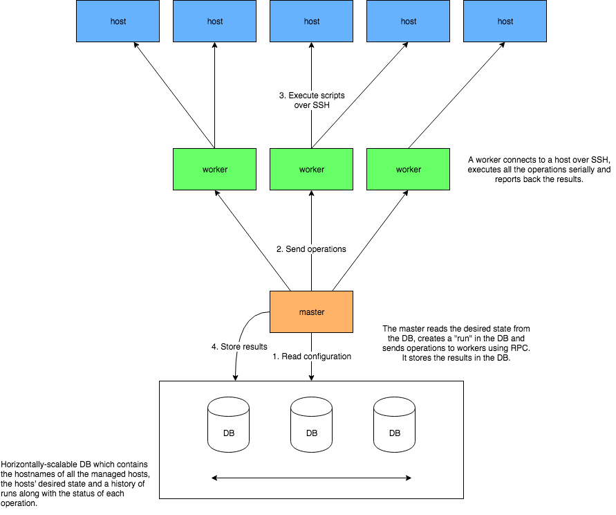

# SimpleCM - A Distributed Configuration Management System

**NOTE: This is a proof of concept and by no means a production-ready tool.**

The idea behind this exercise is to create a simple configuration management tool with built-in
scalability. The system should allow managing the configuration of a large number of remote hosts.

The solution is implemented in Go and uses the standard library almost entirely. The only
exceptions are:

- [github.com/gocql/gocql][5] - used as the database driver.
- [golang.org/x/crypto/ssh][4] - this package is part of the "extended" standard library that is
maintained by the Go community but is not part of the core standard library.

## Design

### General

The high-level design of the system takes an **agentless push mode** approach to configuration
management. This means that configuration changes are sent **from the system to the hosts** without
the need to run an agent on the hosts. A **pull mode** also exists, in which the hosts query the
configuration management system periodically using an agent that runs on each host, then perform
configuration changes locally as needed.

### Components

The solution utilizes two main components: **master** and **worker**.

A master reads the inventory information as well as the desired configuration for each host from
the database, and then sends tasks to one or more workers to be executed against the remote hosts.
It records the results received from the workers and stores them persistently in the database.

A worker receives commands, or "operations", from the master, executes them against the remote host
and reports back the results.

The system currently supports *one master* and an *arbitrary number of workers*.

### Communication

Each worker exposes an **RPC interface** over HTTP, which the master uses to send work to the
workers. During transport, the payload is serialized using `encoding/gob` which is binary-based and
gives very good performance comparing to alternatives.

The *direction* of communication between the master and the workers is *master -> worker*. In terms
of scalability it makes more sense to do it the other way around, that is - to make the workers
"register" with the master and signal that they are ready for work. This is because this way the
master doesn't need to know the network identities of all the workers, which makes the system's
configuration simpler. **However**, unfortunately the [Go RPC library][1] currently does not
support sending requests from the HTTP server to the HTTP client, and using an alternative such as
gRPC was out of the question since it isn't a part of the standard library.

The workers communicate with the remote hosts over **SSH**. SSH allows secure communication over
unsecured networks, and in addition allows interacting with remote hosts easily using shell
commands.

### Workload Distribution

The master uses a simple round-robin algorithm to distribute operations across workers. For every
host, it chooses a worker and sends *all* the operations for that host to the worker. The worker
in turn executes all the operations serially and returns the results synchronously back to the
master.

### Modules and Extensibility

The system can run any operation that can be described using a shell script. This allows a lot of
flexibility when defining new types of operations, or *modules*. A few sample modules were included
in the [modules][6] directory such as `file_exists` and `file_contains`. To add new modules, simply
add new scripts to the directory that is referenced by the `--modules-dir` argument of the workers
(default is `/etc/simple-cm/modules`).

Operations typically require *attributes* which allow the user to control the operation's behavior.
Therefore, the modules are stored as Go [templates][7]. The attributes' values are read from the
database for each instance of an operation, and the template is then rendered with the actual
values before the script is executed by a worker on the remote host.

An sample module:

    #!/bin/bash

    if [ -f {{.path}} ]; then
        if ! grep -q "{{.text}}" {{.path}}; then
            echo "{{.text}}" >> {{.path}}
        fi
    else
        echo "File {{.path}} does not exist"
        exit 1
    fi

This template expects `.text` and `.path` to be interpolated. The rendered script will then check
if the file at `.path` contains the text `.text`, and if not - it will append the text to the file.

>NOTE: Operations need to be **idempotent**. That is - they don't need to perform anything if the
>relevant resource is already in the desired state. It is the responsibility of the operation's
>writer to ensure this is indeed the case.

### Data Model

The data model in this system is relatively simple. There are a few types of queries and they are
all known beforehand and aren't likely to change much. Therefore, a database which supports a
*query-driven approach* is suitable here.

**ScyllaDB** has been chosen as the database type. It supports the data model of the application
well, and in addition supports easy horizontal scalability, which is a major requirement in this
PoC.

The system uses **1 entity table** and **4 dynamic tables**: the entity table stores the hosts as
well as their all the relevant information about them (hostname, credentials etc.). The dynamic
tables store the operations for each host, the runs that are generated by the master and the
results for each operation that is executed during a run.

## Running the Tests

>NOTE: Docker is required for integration tests which involve a database.

To run the entire test suite (both unit tests and integration tests which involve a DB), run `make
test`.

To run unit tests only, run `make unittest`.

## Building

>NOTE: Go is required for building the application from source. The solution was tested using
>**Go 1.10.2**.

To build the executables, run `make`.

To build only the master, run `make master`. To build only the worker, run `make worker`.

## Running the Demo

>NOTE: Docker and Docker Compose are required for running this demo.

To run the demo, run `make demo`. This will use Docker Compose to perform the following:

- Spawn a 3-node ScyllaDB cluster.
- Seed the cluster with dummy data.
- Spawn 3 workers.
- Spawn 5 dummy hosts (these are containers that emulate remote hosts.)
- Run the master.
- Display the results from the DB.
- Clean up.

## Caveats, Limitations and Known Issues

### Master-Worker Communication

The master communicates with the workers using [Go's RPC library][1]. This library is [frozen][3]
and is meant to be replaced by technologies such as [gRPC][2]. The library is suffering from
problems such as no TLS support and therefore - cleartext communication over the wire. **However**,
due to the requirement to use only standard library packages, `net/rpc` was chosen as it provides a
simple RPC interface that is more suitable to the task than, say, a REST API (because the
application is operation-oriented rather than resource-oriented).

### Supported Operating Systems

The system is designed to operate against Linux hosts. Other Unix-based operating systems are
likely to work as well, though these haven't been tested.

## Possible Enhancements

The following enhancements can, and probably should, be done in order to make the system more
scalable, stable and secure.

- Create a UI for managing operations (at the moment things need to be created manually in the DB).
- Make master an always-on service and implement a client to submit runs, query their status etc.
- Support multiple masters. This could greatly increase the maximum scale of the system.
- Use an encrypted transport protocol for master-worker communication.
- Page results from database and handle workload in batches.
- Handle worker disconnections.

[1]: https://golang.org/pkg/net/rpc/
[2]: https://grpc.io/
[3]: https://github.com/golang/go/issues/16844
[4]: https://godoc.org/golang.org/x/crypto/ssh
[5]: https://github.com/gocql/gocql
[6]: modules
[7]: https://golang.org/pkg/text/template/
